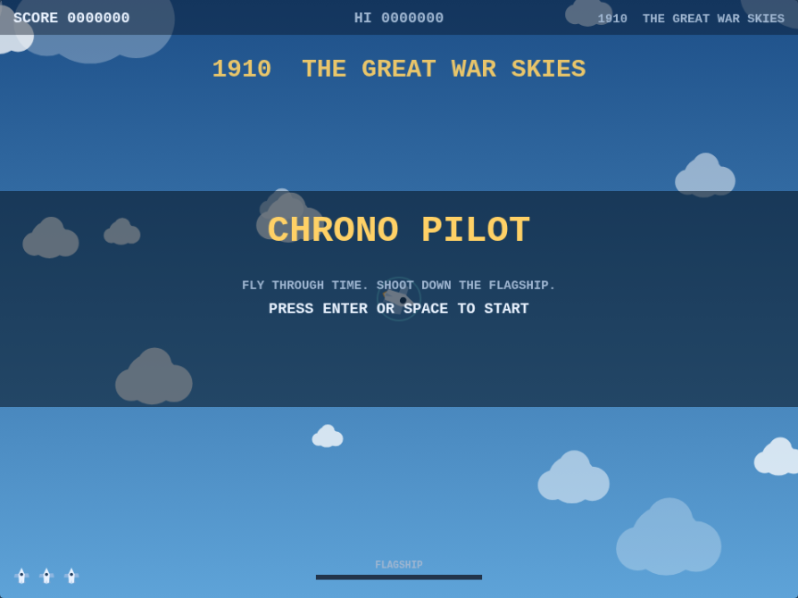
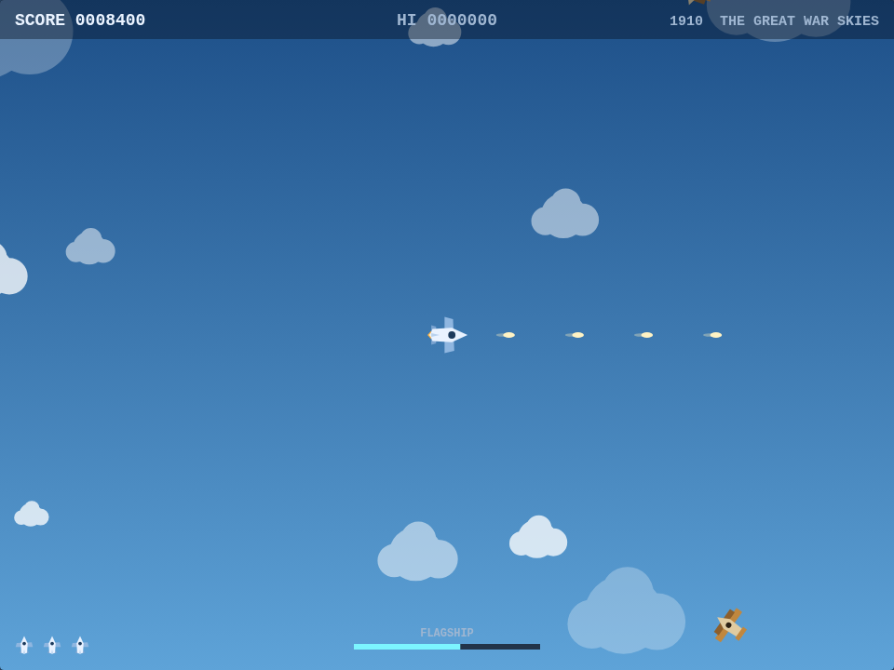
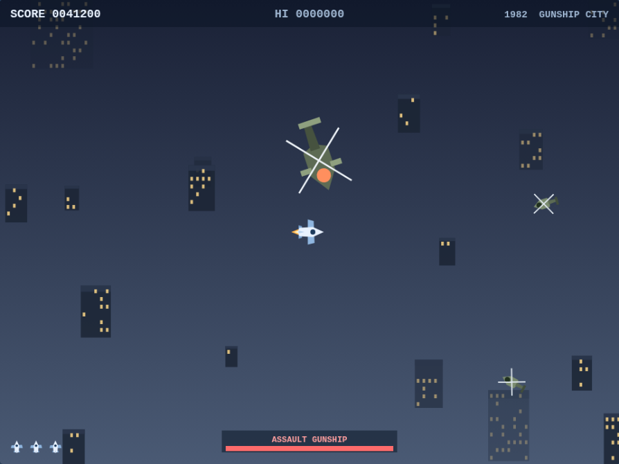

# CHRONO PILOT

コナミの『タイムパイロット』(1982) に着想を得た、全方向スクロールのシューティングゲームです。
自機は常に画面中央に固定され、世界のほうがスクロールします。各時代の護衛機を規定数撃墜すると
その時代の旗艦が現れ、これを撃破すると次の時代へタイムジャンプします。

依存パッケージなしのバニラ JavaScript (ES modules) + Canvas 2D で実装しています。

| タイトル | 1910 THE GREAT WAR SKIES | 1982 GUNSHIP CITY |
| --- | --- | --- |
|  |  |  |

## 遊びかた

### スマートフォン・タブレット

タッチ機器では画面上にコントロールが出ます。

- **左のスティック** — 画面左側のどこでも指を置いた場所がスティックの中心になります。そこから指を動かした方向へ旋回します。
- **FIRE ボタン** — 押しているあいだ射撃します。
- **AUTO** — 自動連射のオン / オフ。初期状態はオンなので、片手 (スティックだけ) でも遊べます。
- **一時停止ボタン** — 右上。
- タイトル画面とゲームオーバー画面は画面タップで進みます。

画面の形に合わせて表示領域も変わります (縦持ちなら縦長、横持ちなら横長)。横持ちのほうが広く見渡せます。

### キーボード

| 操作 | キー |
| --- | --- |
| 旋回 (8方向) | 方向キー / `W` `A` `S` `D` |
| ショット | `SPACE` / `Z` / `J` |
| スタート・コンティニュー | `ENTER` (または `SPACE`) |
| ポーズ | `P` / `ESC` |
| ミュート切り替え | `M` |

- 自機は常に前進します。止まることはできません。入力した方向へ、旋回速度の範囲で機首を向けます。
- 敵機も旋回速度に制限があるため、こちらを狙って突っ込み、行き過ぎて旋回して戻ってきます。
  この「すれ違いざまの撃ち合い」がゲームの中心です。
- 画面下の `FLAGSHIP` ゲージが満タンになると旗艦が出現します。旗艦が画面外にいるあいだは
  赤い矢印が方向を示します。
- 撃墜した敵からはパラシュート降下兵が出ることがあります。接触して救助するとボーナス
  (500 → 1000 → 2000 → 4000 → 8000 点) が入ります。ミスすると連鎖はリセットされます。
- 50,000 点ごとに自機が 1 機増えます。ハイスコアは `localStorage` に保存されます。

## 時代 (ステージ)

| 時代 | 敵機 | 旗艦 | 背景 |
| --- | --- | --- | --- |
| 1910 | 複葉機 | ZEPPELIN | 青空と積雲 |
| 1940 | 戦闘機 | HEAVY BOMBER | 荒れた雲海 |
| 1970 | ジェット機 | STEALTH WING | 高層の巻雲 |
| 1982 | ヘリコプター | ASSAULT GUNSHIP | 夜間の市街地 |
| 2084 | UFO | MOTHERSHIP | 宇宙空間 |

2084 をクリアすると 1910 に戻り、敵の速度・旋回性能・同時出現数が上がった 2 周目に入ります
(1 周ごとに 28% ずつ強化)。

難易度カーブは `src/game/levels.js` の表にすべて入っています。設計方針は 2 つです。

- **1910 はチュートリアル**。同時に出る護衛機は 2 機まで、速度は自機の 4 割、ほとんど撃ってこず、
  ツェッペリンは護衛を呼びません。初見でもここは抜けられるべき、という基準にしています。
- **表の数値は時代が進むほど必ず厳しくなる方向にしか動かない**。単調性は
  `tests/levels.test.js` で検証しているので、1 つの時代だけ調整して curve が崩れると
  テストが落ちます。

## 実行

ES modules を使っているため、`file://` ではなく HTTP サーバー経由で開いてください。

```sh
npm start          # http://localhost:8080 で配信
# あるいは
npx http-server -p 8080
```

## テスト

```sh
npm test           # node --test (依存パッケージなし)
```

角度の正規化・最短回転・当たり判定・地形ハッシュなど、
描画に依存しない純粋なロジックを `tests/` で検証しています。

## 構成

```
index.html            画面と操作説明
src/main.js           起動処理とメインループの結線
src/core/loop.js      固定タイムステップのゲームループ
src/core/input.js     キーボード入力 (押下中 / このフレームで押された)
src/core/math.js      角度・乱数・当たり判定・決定性ハッシュ
src/core/audio.js     WebAudio による効果音 (音声ファイルなし)
src/render/sprites.js ベクター描画のスプライト (すべて +X 方向が機首)
src/game/game.js      状態遷移・スポーン・当たり判定の解決・描画順
src/game/levels.js    時代ごとの定義 (敵・旗艦・空・難易度)
src/game/background.js 無限にスクロールする視差背景
src/game/player.js    自機
src/game/enemy.js     護衛機の追尾 AI
src/game/boss.js      旗艦
src/game/parachutist.js 救助対象
src/game/effects.js   爆発・衝撃波・スコア表示
src/game/hud.js       スコア・残機・ゲージ・各種メッセージ
```

背景は状態を持ちません。各視差レイヤーをグリッドに区切り、セル座標を決定性ハッシュに
かけて中身を決めているため、世界は全方向に無限で、戻ってきても同じ景色になります。

## 今後の予定

- ゲームパッド対応とタッチ操作
- 攻撃パターンを持つ旗艦 (現状は追尾 + 3way 弾のみ)
- BGM と、時代ごとの効果音の作り分け
- Playwright によるヘッドレス動作テストの CI 組み込み
