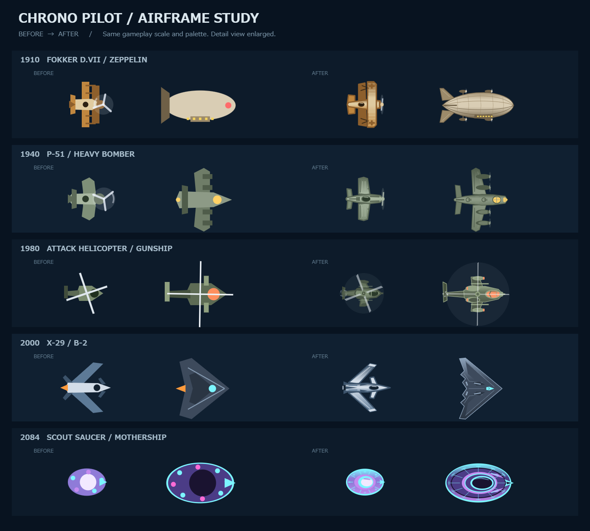
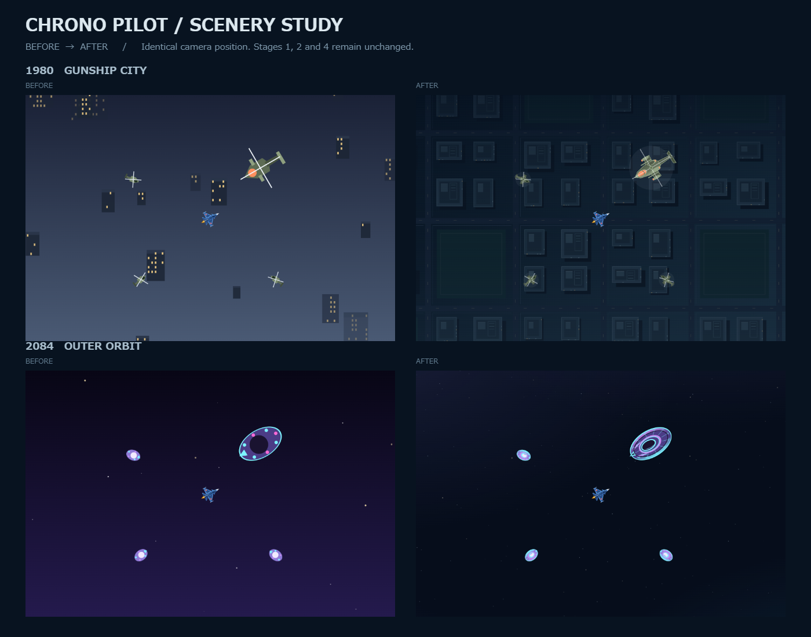

# 敵機・旗艦・背景のデザイン更新

ゲームの挙動を変えず、5時代の敵機と旗艦、1980と2084の背景を更新しました。

| 面 | 敵機 | 旗艦 | 背景 |
| --- | --- | --- | --- |
| 1910 | フォッカーD.VII風の複葉機。翼のリブ、支柱、開放式コックピット | ツェッペリン風の船体。骨組み、ゴンドラ、エンジンポッド | 変更なし |
| 1940 | P-51風の長い機首と絞られた主翼、バブルキャノピー | B-17風の4発重爆撃機。エンジン、銃座、機首の窓 | 変更なし |
| 1980 | タンデム座席の攻撃ヘリ。短翼とテールローター | 装甲ガンシップ。双発タービン、武装ポッド、ローター | 紺色を基調とする俯瞰の夜間都市。連続する街路、屋上、控えめな灯り |
| 2000 | X-29風の前進翼、細い機首、カナード | B-2風の全翼形状と鋸歯状の後縁 | 変更なし |
| 2084 | 分割装甲、ドーム、リムの灯りを持つ円盤 | 同じ造形言語の多層マザーシップ | 暗い宇宙、3層の星、輪郭をぼかした淡い星雲 |

実機は造形のモチーフです。ゲームの年代や設定は変更していません。

## 比較画像

機体の細部を拡大した比較（左が変更前、右が変更後）:

同じカメラ位置・同じ機体配置での背景比較:

## Claude Codeへの引継ぎ

ゲーム用コードの変更は `src/render/sprites.js` と `src/game/background.js` の2ファイルのみです。

- 敵機・旗艦はCanvasベクター描画を継続。新しい画像の読み込みや外部依存はありません。
- 機首は+X、原点は機体中心。従来の描画範囲に収め、当たり判定・呼出側の拡大率は変更していません。
- 機体の塗色は渡されたパレットから生成します。被弾時の白いパレットと呼出側の半透明設定も維持します。
- `drawPlayer`、自機の画像素材、僚機、パラシュート、装備、弾、スコア、敵AI、ステージ設定は変更していません。
- 1980と2084だけ背景描画を分岐。街の窓と星はワールド座標のハッシュで決め、描画はゲーム用乱数を消費しません。
- 通信系および `game.js` には変更がありません。

## 確認結果

- `node tools/build-standalone.mjs`: 成功（import漏れ・トップレベル名衝突の検査を含む）。
- `node --test "tests/**/*.test.js"`: 45件成功。
- Edge/ChromiumでES modules版と単一HTML版を起動。単一HTML版はEnter操作でプレイ画面まで遷移し、ブラウザ例外は0件。
- 1910・1940・2000の背景: 3つのカメラ位置ずつ、合計9ケースで変更前とピクセル一致。
- 自機5機種: 変更前とピクセル一致。
- 夜景・宇宙: 原点、負の座標、セル境界を含む合計6ケースで、別地点へ移動して戻ったときにピクセル一致。
- 敵機・旗艦10種: パレットを変更せず、描画後にCanvasの変換・透明度・合成モードなどが保存されることを確認。
- デスクトップで全5面、タッチ端末相当の390×844表示で1980・2084を目視確認。実機スマートフォンでの性能測定は未実施。

## 造形参考

- [NASA: X-29 Advanced Technology Demonstrator](https://www.nasa.gov/aeronautics/nasa-aircraft/x-29-demonstrator/)
- [National Museum of the U.S. Air Force: P-51D Mustang](https://www.nationalmuseum.af.mil/Visit/Museum-Exhibits/Fact-Sheets/Display/Article/196263/north-american-p-51d-mustang/)
