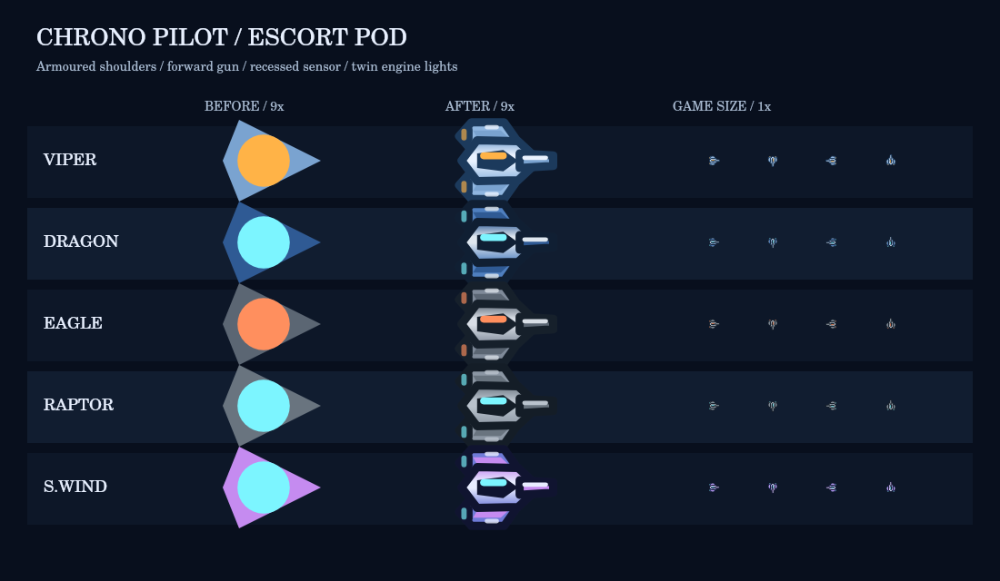

# 随伴ポッドのデザイン更新

PODモジュールとS.WINDのBITが共用する随伴ポッドを、小型の無人兵装として描き直しました。

- 左右の装甲ユニット、中央のセンサー、前方の砲口、後部のノズル灯を追加。
- 母機5種類のパレットを継承。画像素材・外部依存の追加なし。
- 外装の常時回転を取り除き、呼出側の照準方向（+X）と砲口を一致。後部の灯りだけが緩やかに明滅します。
- 原点中心、半径約7pxの小さな描画範囲を維持。追従、照準、射撃間隔、威力、個数、装備、当たり判定は変更していません。

比較画像は実際のCanvas描画です。左が従来、中央が更新後（9倍）、右が実寸の4方向です。

## Claude Codeへの引継ぎ

ゲーム用コードの変更は `src/render/sprites.js` の `drawPod` のみです。PR #14の描画ヘルパーを利用しています。Canvas状態はsave/restoreで保存し、パレットを書き換えません。

## 確認

- 既存テスト45件成功。
- `node tools/build-standalone.mjs` 成功。
- Canvasで5配色・4方向の描画を目視確認。
- 5配色×3時刻で、Canvas状態とパレットが描画前後で一致。
- 実機スマートフォンでの表示・性能確認は未実施です。
